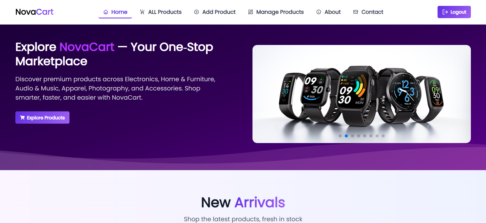

# 🛒 NovaCart — Full-Stack E-Commerce Website with Next.js 

## Description
**NovaCart** is a modern full‑stack e‑commerce website that makes shopping and product management simple. Users can browse, search, and filter products with detailed info and images to guide decisions. Logged‑in users can add new products from the **Add Product** page, view their own added products in the **Manage Products** page, and delete them if needed. The platform focuses on speed, clean design, and intuitive navigation for a seamless experience.

---  
## 🌐 Live Demo
👉 [NovaCart (Vercel)](https://nova-cart-web.vercel.app)   

## 📂 GitHub Repositories
- Client Repository: [NovaCart (Client)](https://github.com/Islamul-Hoque/NovaCart)  
- Server Repository: [NovaCart (Server)](https://github.com/Islamul-Hoque/NovaCart-Server)
---

## 📸 Screenshot
 

---

## 🚀 Tech Stack

Core:
  - Next.js 16+ (App Router)
  - React 18+
  - Tailwind CSS

UI / UX:
  - DaisyUI (UI utilities)
  - SwiperJS (Customer Reviews slider)
  - Framer Motion (smooth animations & micro-interactions)

Authentication:
  - Cookie‑based Mock authentication 

Backend:
  - MongoDB + Express API (external backend)

Utilities:
  - SweetAlert2 (confirmation alerts for product deletion)
  - React Toastify (notifications)
  - date-fns (date formatting)

---

## 🌐 API Endpoints (Backend)

```
GET /all-products        → Fetch all products
GET /all-products/:id    → Fetch single product details
POST /all-products       → Add new product
GET /manage-products     → Fetch products by user email
DELETE /manage-products/:id → Delete product by ID
```

---

## 🧩 Key Features

* Cookie‑based Mock authentication 
* Add & manage products (for logged‑in users)
* Dynamic product listing with category & search filters
* Product Details Page
* Fully responsive UI (optimized for mobile, tablet, and desktop breakpoints)
* Clean, gradient‑driven interface with modern styling

---

## 🧭 Run the Project Locally

### 1. Clone Repositories
### Client (Next.js Frontend):

```
git clone https://github.com/Islamul-Hoque/NovaCart.git
cd NovaCart
```
### Server (Express + MongoDB Backend):

```
git clone https://github.com/Islamul-Hoque/NovaCart-Server.git
cd NovaCart-Server
```

### 2. Install Dependencies

```
npm install
```

### 3. Setup Environment Variables

Backend `.env` (Express + MongoDB):

```
DB_USER=your_db_username
DB_PASS=your_db_password
```

### 4. Start Development Servers
**Backend:**

```
nodemon index.js
```

**Frontend:**
```
npm run dev
```

Visit: [http://localhost:3000](http://localhost:3000)

---

## 🛠 Build & Deploy

### Build

```
npm run build
```

### Start Production

```
npm start
```

Deploy on:

* **Vercel** (official Next.js platform, GitHub integration for auto deploys)
* **Netlify** (optional)

---

## 📄 License
This project is intended solely for educational and portfolio purposes, not for commercial use.

--- 

## 👤 Author

**Islamul Hoque**  
*MERN Stack Web Developer*  

📍 **Chattogram, Bangladesh**  
📧 **islamulhoque2006@gmail.com**  

🔗 **Social Links:**  
- [GitHub](https://github.com/Islamul-Hoque)  
- [LinkedIn](https://linkedin.com/in/Islamul-Hoque)  
- [Facebook](https://facebook.com/ISLAMUL.HOQUE.ISHFAK.OFFICIAL)  
- [Twitter](https://twitter.com/ISHFAK2003)